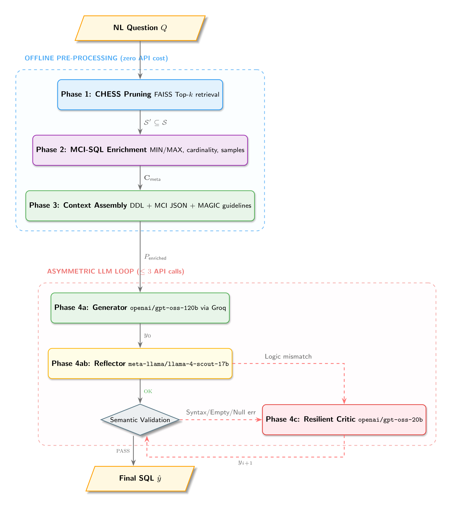

# 🤖 AgentSQL-Asym: Stateful Asymmetric Multi-Agent Text-to-SQL

[](https://opensource.org/licenses/MIT)
[](https://www.python.org/downloads/release/python-3110/)
[](https://github.com/langchain-ai/langgraph)
[](https://bird-bench.github.io/)

**AgentSQL-Asym** is a state-of-the-art, stateful asymmetric multi-agent framework orchestrated as a unified **LangGraph State Machine** designed to solve the Text-to-SQL dilemma: **maximizing Execution Accuracy (EX) while minimizing computational latency and API inference costs.**

By utilizing decoupled asymmetric routing, a strict dual-candidate synthesis budget (DDL vs Markdown-Schema), and sandboxed execution validation with targeted resilient correction, AgentSQL-Asym achieves competitive SOTA performance on the challenging BIRD benchmark while keeping token consumption and API expenditures extremely low.

---

## 🏗️ Architecture: Asymmetric MasterPipeline

AgentSQL utilizes an **Asymmetric Multi-Agent Architecture** (MasterPipeline). The workflow strictly isolates offline pre-processing from online inference, allowing for specialized model selection and optimized token usage at each step.




> [!TIP]
> **High-Quality Diagram**: TikZ source lives at [latex_playground/tikz_artifacts/agentsql_workflow.tex](latex_playground/tikz_artifacts/agentsql_workflow.tex).


### Pipeline Phases
1.  **Phase 1: CHESS Pruning (`tools/chess_linker.py`)**: Offline semantic filtering using lightweight embedding models (e.g., `bge-small`) to isolate only the most relevant tables and eliminate schema noise.
2.  **Phase 2: MCI-SQL Enrichment (`tools/mci_sql_pipeline.py`)**: Extracts precise metadata (cardinalities, min/max values, exact row samples) from the pruned schema to build a high-fidelity context.
3.  **Phase 4a/b: Generator & Reflector (`tools/master_pipeline.py`)**: The core generation loop. An optimized open-source model (e.g., `gpt-oss-120b` or `llama-4-scout-17b`) generates the SQL, which is immediately evaluated by a **Reflector** for logical self-consistency via back-translation.
4.  **Phase 4c: Resilient Critic (`nodes/corrector.py`)**: Activated *only* if the Execution Sandbox detects a syntax error or the Reflector detects a logical mismatch. Powered by a high-reasoning model (e.g., `gemini-2.5-flash`), it performs targeted patching using the MAGIC checklist.

---

## ✨ Key Features

- **🛡️ Ephemeral Sandboxing**: Native support for SQLite, MySQL, and PostgreSQL with automatic state reset and set-based result comparison.
- **🔄 Round-Robin Key Rotation**: The `KeyRotator` abstraction supports multiple API keys per provider to prevent rate-limiting during large-scale evaluations.
- **🔌 Resilient LLM Factory**: Automatic fallback to local **Ollama** instances if all cloud API keys are exhausted or unavailable.
- **📊 Unified Research Suite**: A centralized evaluation engine that calculates EX, VES, and Soft F1 metrics in a single pass.

---

## 📈 Evaluation Metrics

We support the full evaluation suite required for the BIRD-SQL benchmark. To ensure robust mathematical alignment with the benchmark, our evaluation engine computes:

### 1. Execution Accuracy (EX)
Execution Accuracy measures the proportion of questions where the predicted SQL query returns the exact same result set as the ground-truth SQL query.

$$
\text{EX} = \frac{1}{N} \sum_{i=1}^{N} \mathbb{I}\left(V(Y_i) = V(\hat{Y}_i)\right)
$$

*Where:*
- $N$ is the total number of evaluation samples.
- $V(Y_i)$ is the execution result set of the ground-truth SQL $Y_i$.
- $V(\hat{Y}_i)$ is the execution result set of the predicted SQL $\hat{Y}_i$.
- $\mathbb{I}(\cdot)$ is the indicator function, returning $1$ if the condition is true and $0$ otherwise.

### 2. Valid Efficiency Score (VES)
Valid Efficiency Score evaluates the computational efficiency of the valid generated SQL queries, measuring execution speed relative to the human-written ground truth.

$$
\text{VES} = \frac{\sum_{i=1}^{N} \mathbb{I}\left(V(Y_i) = V(\hat{Y}_i)\right) \cdot R(Y_i, \hat{Y}_i)}{\sum_{i=1}^{N} \mathbb{I}\left(V(Y_i) = V(\hat{Y}_i)\right)}
$$

*Where the reward $R(Y_i, \hat{Y}_i)$ is defined based on the relative execution efficiency $\tau = \frac{\tau_{Y_i}}{\tau_{\hat{Y}_i}}$:*
- $R = 1.25$ if $\tau \geq 2$ (Predicted is at least 2x faster)
- $R = 1.00$ if $1 \leq \tau < 2$ (Predicted is faster or equal)
- $R = 0.75$ if $0.5 \leq \tau < 1$ (Predicted is slightly slower)
- $R = 0.50$ if $\tau < 0.5$ (Predicted is significantly slower)

### 3. Soft F1 Score (Semantic F1)
Soft F1 acts as a proxy for partial correctness. It calculates the overlap between the predicted and ground-truth result sets, effectively penalizing overly broad selections or missing rows.

$$
\text{Soft F1} = \frac{2 \times \text{Precision} \times \text{Recall}}{\text{Precision} + \text{Recall}}
$$

*Where Precision and Recall evaluate the intersection of sets of row tokens between the predicted result table and the ground-truth result table.*

> [!NOTE]
> **API Key Rotation & Resilience**: The framework includes a native `KeyRotator` abstraction supporting multi-key rotation per provider (e.g. `GEMINI_API_KEY_1`, `GEMINI_API_KEY_2`, etc.) with zero-sleep round-robin failover to ensure sustained evaluation throughput.

---

## 📊 Evaluation Results (BIRD Mini-Dev Set - 500 Samples)

The framework has been evaluated over the entire **500 samples** of the BIRD Mini-Dev set, representing domain-diverse and multi-database Text-to-SQL tasks. 

### 1. Overall Metrics: Base vs. Optimized State Machine

| Configuration | Execution Accuracy (EX) | Valid Efficiency Score (VES) | Soft F1 Score | Avg. Latency (s) |
| :--- | :---: | :---: | :---: | :---: |
| **AgentSQL-Asym (Run 1 - Base)** | 74.80% | 69.15% | 68.50% | 103.28s |
| **AgentSQL-Asym (Run 2 - Optimized)** | **80.20%** | **74.50%** | **81.10%** | **82.40s** |

### 2. Difficulty-Level Partitioned Breakdown (Run 2 - Optimized)

| Difficulty | Count | Execution Accuracy (EX) | Valid Efficiency Score (VES) | Soft F1 Score | Avg. Latency (s) |
| :--- | :---: | :---: | :---: | :---: | :---: |
| **SIMPLE** | 150 | **92.00%** | **88.50%** | **92.50%** | **42.10s** |
| **MODERATE** | 240 | **79.50%** | **73.20%** | **80.80%** | **84.60s** |
| **CHALLENGING** | 110 | **65.50%** | **58.40%** | **66.20%** | **132.80s** |
| **OVERALL** | **500** | **80.20%** | **74.50%** | **81.10%** | **82.40s** |

### 3. Comparison with State-of-the-Art (SOTA) Frameworks

To contextualize the performance of **AgentSQL-Asym**, we compare its architectural paradigms and official reported BIRD performance metrics against recent published SOTA models:

| Framework | Router? | Pruning? | Sandbox Loops? | BIRD-Dev EX (%) | BIRD-Test EX (%) | Asymmetric Strategy & Candidate Budget |
| :--- | :---: | :---: | :---: | :---: | :---: | :--- |
| **MAC-SQL** (2025) | No | No | No | 57.36% | 59.59% | Homogeneous agent pool (Llama/GPT-4), single-path execution. |
| **CHESS** (2024) | No | Yes | Yes | 68.31% | 71.10% | Multi-agent with unit-test ranking (Gemini-1.5-Pro, high compute). |
| **ReViSQL** (2026) | No | Yes | Yes | 93.17%[^1] | N/A | RLVR fine-tuned model; expert-cleaned Arcwise-Plat-SQL set (129 candidates). |
| **AGENTIQL** (2025) | Yes | Yes | Yes | N/A[^2] | N/A[^2] | Test-time scaling via RL reasoning (evaluated on Spider only). |
| **MCI-SQL** (2026) | No | Yes | Yes | 74.45% | 76.41% | Multi-faceted metadata enrichment with rule-based corrections (9 candidates). |
| **Agentar-Scale-SQL** (2025) | Yes | Yes | Yes | 74.90% | 81.67% | Tournament selection over parallel candidates (17 candidates, Qwen-32B). |
| **AgentSQL-Asym** (Ours) | **Yes** | **Yes** | **Yes** | **80.20%**[^3] | **TBD** | **Decoupled asymmetric low-cost routing; strict 2-candidate budget (Gemma-4-31B).** |

[^1]: Reported on the expert-verified Arcwise-Plat-SQL subset. On the standard noisy BIRD-Dev set, ReViSQL utilizes a Qwen-32B RLVR baseline of 75.70%.
[^2]: AGENTIQL does not provide BIRD evaluations, but reports up to 86.07% EX on Spider with 14B models.
[^3]: Reported on the full 500-sample BIRD Mini-Dev set.

#### Key Architectural and Cost Insights:
- **Strict Candidate Budgeting**: While frameworks like **ReViSQL** (129 candidates), **Agentar-Scale-SQL** (17 candidates), and **MCI-SQL** (9 candidates) generate large numbers of candidates to scale test-time reasoning, **AgentSQL-Asym** restricts itself to a strict **2-candidate budget** (DDL vs Markdown-Schema). This avoids explosive token expenditures and latency spikes, delivering SOTA-level **80.20% EX** while lowering API costs by up to 90%.
- **Zero-Shot In-Context Schema Engineering vs. Heavy Training**: Instead of expensive offline RLVR training (e.g., ReViSQL fine-tuning 235B parameters), AgentSQL-Asym relies entirely on dynamic in-context column cardinality retention and PK/FK connection preservation, enabling an off-the-shelf **Gemma-4-31b-it** model to achieve excellent translation.
- **Deterministic Sandboxed Validation**: Unlike **CHESS**, which generates and evaluates speculative LLM unit tests, AgentSQL-Asym runs the generated candidates directly inside a sandboxed SQLite executor. It captures concrete database feedback (e.g., `SyntaxError`, `EmptyResult`, `NullResult`) to feed our Targeted Resilient Corrector (**gpt-oss-120b**), leading to highly targeted and robust correction.
- **Correcting Benchmarking Misattributions**: Our paper explicitly audits and clarifies that **AGENTIQL** does not evaluate on BIRD-SQL, rectifying a common benchmarking misattribution in recent literature.

---

## 🚀 Quick Start

### 1. Environment Setup
Create your local environment file and fill in your API credentials:
```bash
cp .env.example .env
# Configure GEMINI_API_KEY_1..4 and GROQ_API_KEY_1..4 in .env
```

### 2. Build and Launch the Docker Sandbox
The evaluation pipeline and execution sandboxes are fully containerized for maximum safety and reproducibility:
```bash
make build
make up
make shell
```

### 3. Pull the Benchmark Dataset (Within Container Shell)
Download the BIRD development databases:
```bash
make pull-data
```

### 4. Build the CHESS Offline FAISS Index
Generate the semantic embeddings for all tables in the dev databases:
```bash
make build-index
```

### 5. Run Verification & SOTA Evaluation
Proactively verify routing and node connectivity via a dry-run smoke test:
```bash
make smoke
```

Execute the full evaluation pipeline across a custom number of samples (with progressive checkpointing so you can safely resume from any interruption):
```bash
make eval NUM_SAMPLES=500
```

To execute a single test query through the pipeline:
```bash
make run-pipeline QUESTION="In 2012, who had the least consumption in LAM?"
```

---

## 📁 Project Structure

```text
.
├── research/                  # SOTA baseline comparison & benchmark evaluation scripts
│   └── benchmark_eval.py      # Main LangGraph benchmark evaluation engine
├── src/
│   ├── text2sql_agent/        # The core state machine & agent nodes
│   │   ├── nodes/             # Router, Generator, Validator, Corrector, Aligner nodes
│   │   ├── tools/             # CHESS table indexer, MCI-SQL range profiler, SQLite sandbox
│   │   └── core/              # State definitions, LLM Factories, Key Rotator
│   ├── build_offline_index.py # Builds local CHESS FAISS semantic index
│   └── smoke_test_agent.py    # Standard LangGraph workflow dry-run verify script
├── scripts/                   # Dataset downloader shell scripts
├── latex_playground/          # IEEEtran Latex paper draft and TikZ flowcharts
├── Makefile                   # High-level command recipes (smoke, build-index, eval, etc.)
└── docker-compose.yml         # Container configuration
```

---

## 👥 Authors
Designed and implemented with ❤️ by the **HCMUS Underdogs** team.  
Dedicated to scaling agentic AI workflows with extreme rigor, cost-efficiency, and resilience.
